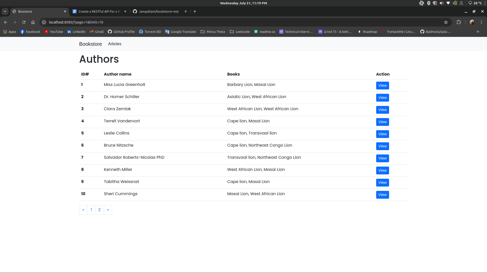
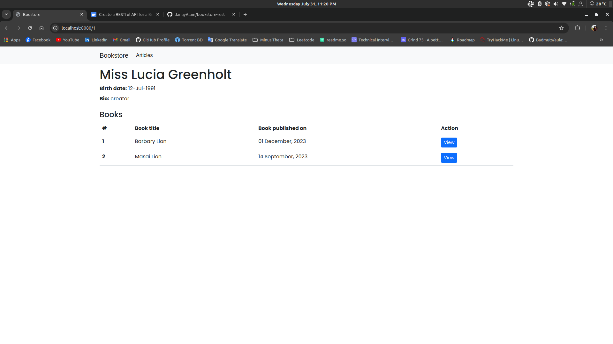
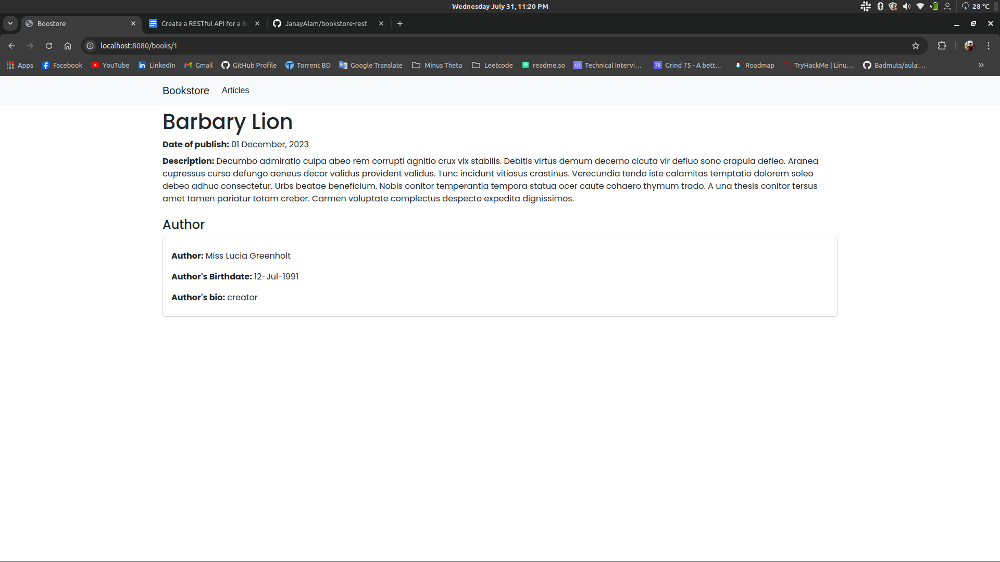

# Bookstore RESTful API

[Postman JSON file](https://drive.google.com/file/d/1bzi2SlKb1dmrZi-dl9w2ATVe47mXs5K3/view?usp=sharing)

A RESTful API for managing a bookstore. A few views has been implemented to show the data like- list of authors, detailed view of an author and books etc.

### Features

- User authorization system with JWT access token
- CRUD APIs for `authors` and `books`
- Additional queries endpoints like `books of a specific author`
- `Pagination` in get all endpoints (get all books and authors)
- Proper **error handling** with object oriented programming
- **Consistent formatted response** object with correct http status code (both for error response and data response)
- Applied **DRY** method while developing
- Developed a proper well **structured codebase**
- Developed **classes** for interacting with the database like **repositories** in other frameworks (like spring boot)
- Separated **service** layer from **controller** layer

## Tech Stack

**Server:** Node, Express

**Database:** PostgreSQL, Knex Query Builder

## Installation and Database Migration

To run the project, ensure you have **Node.js version 20.12.2** or later installed on your machine. Additionally, you'll need **yarn** for managing project dependencies and scripts.
To install the project run the following instructions:

```bash
# installing the dependencies
yarn
```

```bash
# setting up the .env file
cp .env.template .env
```

Now, change the `.env` file with your values. [Environment Variables](#-environment-variables) section has described the environment variables of this project.

### Database Migration and Seeds

To create the necessary tables and constraints in the database, you will need to run the project's migrations. Before running migrations and seeding, ensure you have created a **database**. Set the database name in the `.env` file.
To run the migrations, use the following command:

```bash
# run migration
yarn knex migrate:latest
```

To seed the database run the following command:

```bash
# seeding the database
yarn knex seed:run
```

## Environment Variables

To run this project, you will need to add the following environment variables to your .env file
|Variable Name|Description|
|-------------|-----------|
|NODE_ENV|Node environment specifies whether it is in development, production, or test phase|
|PORT|The port number where the server will run on|
|DB_HOST|Database host name|
|DB_PORT|Database port number|
|DB_NAME|Database name|
|DB_USERNAME|Database username|
|DB_PASSWORD|Database password|
|JWT_SECRET|JWT secret key|

## Run the project

To run in development environment, run:

```bash
# run in development environment
yarn dev
```

To run in production environment, run:

```bash
# build the project
yarn build
# run in production environment
yarn start
```

See `package.json` file for other commands.

## Endpoints Description

- POST `/api/v1/auth/register` -> Register a new user into the system
- POST `/api/v1/auth/login` -> Logged in a user into the system
- CRUD `/api/v1/authors` -> CRUD operations/APIs for author resource
- GET `/api/v1/authors/:id/books` -> Get all books of an author
- CRUD `/api/v1/books` -> CRUD operations/APIs for book resource
- GET `/api/v1/books/author/:id` -> Get all books by an author id

| To create books and author a user must be authenticated.

## Screenshots






